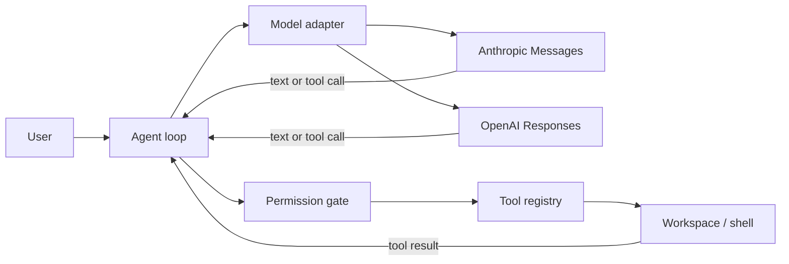

# HelloCode

[](https://github.com/ChanTso/HelloCode/actions/workflows/ci.yml)
[](https://nodejs.org/)
[](LICENSE)

A small, practical coding agent for the terminal, built in TypeScript around one model–tool loop.

HelloCode gives a capable model a focused set of workspace tools, streams its work, enforces permission boundaries, and retains enough context for real repository tasks. It supports Anthropic Messages and OpenAI Responses-compatible endpoints without turning the core loop into a provider framework.

```text
$ hellocode
HelloCode · openai/gpt-5.6-luna · default
/work/api

› add validation to the user endpoint and run its tests
→ search_text router.post in src
✓ search_text
→ read_file src/routes/users.ts
✓ read_file
→ edit_file src/routes/users.ts
✓ edit_file
→ run_command npm test -- users
? Allow shell: "npm test -- users"? [y/N] y
✓ run_command

Added request validation and covered the invalid-input path. The focused test suite passes.
```

## Quick start

Requires Node.js 22 or newer.

```sh
npm install --global https://github.com/ChanTso/HelloCode/releases/download/v0.2.0/hellocode-agent-0.2.0.tgz
```

For Anthropic:

```sh
export ANTHROPIC_API_KEY="your-api-key"
hellocode
```

For OpenAI or a Responses-compatible API root:

```sh
export HELLOCODE_PROVIDER="openai"
export HELLOCODE_API_KEY="your-api-key"
export HELLOCODE_BASE_URL="https://gateway.example/v1"
export HELLOCODE_MODEL="gpt-5.6-luna"
hellocode
```

`HELLOCODE_BASE_URL` is the API root consumed by the SDK. Include `/v1` when the endpoint requires it; HelloCode does not guess or rewrite paths.

To install from a local checkout:

```sh
git clone https://github.com/ChanTso/HelloCode.git
cd HelloCode
npm ci
npm link
```

## What it does

- Runs a direct `model → tool → model` loop with streamed text and complete tool-call history.
- Reads, lists, searches, creates, and edits files inside one canonical workspace.
- Runs project commands with approval, timeouts, bounded output, and cancellation.
- Protects sensitive file access and rejects file-tool paths that escape through traversal or symlinks.
- Supports interactive work, one-shot output, read-only planning, and an explicit permission bypass.
- Saves workspace-scoped sessions with private file permissions and resumes them with `--continue`.
- Preserves provider replay state when safe and removes it when the provider, model, or endpoint changes.
- Compacts older turns and oversized tool results without breaking tool-call/result pairs.
- Loads a bounded, non-symlinked root `AGENTS.md` as project guidance.

### Tools

| Tool          | Purpose                                                         |
| ------------- | --------------------------------------------------------------- |
| `read_file`   | Read UTF-8 files with line numbers and pagination               |
| `list_files`  | List files with lightweight glob matching                       |
| `search_text` | Literal search with a built-in fallback; regex search uses `rg` |
| `edit_file`   | Make an exact, uniqueness-checked replacement                   |
| `write_file`  | Create a file or explicitly replace one                         |
| `run_command` | Run a shell command with a timeout and bounded output           |

## Usage

Start an interactive session:

```sh
hellocode
```

Run once. Assistant text goes to stdout; progress and errors go to stderr:

```sh
hellocode --print "explain why the tests fail"
echo "summarize the current diff" | hellocode --print
```

Resume the latest session for the current workspace:

```sh
hellocode --continue
```

Useful options:

```text
-p, --print                          Run once and exit
-c, --continue                       Resume the latest workspace session
    --provider <name>                Use anthropic or openai
-m, --model <id>                     Select a model
    --base-url <url>                 Use a compatible API root
-C, --cwd <path>                     Use a different workspace
    --plan                           Deny edits and shell commands
    --dangerously-skip-permissions   Skip approval prompts
    --no-save                        Do not write local session history
    --max-turns <number>             Bound model turns for one request
```

Inside interactive mode, `/help`, `/clear`, `/compact`, and `/exit` manage the current conversation.

### Permissions

| Action                   | Default | `--plan`                   | `--dangerously-skip-permissions` |
| ------------------------ | ------- | -------------------------- | -------------------------------- |
| Ordinary workspace reads | Allow   | Allow                      | Allow                            |
| Workspace edits          | Allow   | Deny                       | Allow                            |
| Sensitive file access    | Ask     | Ask for reads; deny writes | Allow                            |
| Shell commands           | Ask     | Deny                       | Allow                            |

Approval-required actions are denied in print mode because there is no interactive prompt. The bypass flag skips HelloCode's approval gate; it does not disable the file tools' workspace boundary.

## Model compatibility

HelloCode selects a protocol explicitly; it never guesses from a model name and never retries a request through another provider.

| Provider setting | Protocol surface        | Status      | Notes                                                                                                                                     |
| ---------------- | ----------------------- | ----------- | ----------------------------------------------------------------------------------------------------------------------------------------- |
| `anthropic`      | Anthropic Messages      | Supported   | Default provider; model default is `claude-sonnet-5`                                                                                      |
| `openai`         | OpenAI Responses        | Supported   | Model default is `gpt-5.6-luna`; custom API roots are allowed                                                                             |
| `openai`         | CLIProxyAPI → Luna      | Live-tested | Streaming text and a complete multi-turn tool lifecycle were verified through [CLIProxyAPI](https://github.com/router-for-me/CLIProxyAPI) |
| —                | OpenAI Chat Completions | Not used    | A text response is not enough; HelloCode requires reliable tool-call replay                                                               |

Gateway model listings are not a compatibility guarantee. A model is suitable only if its Responses route streams valid function calls and accepts matching `function_call_output` items on the next turn. DeepSeek was not available in the test endpoint for this release and is not claimed as verified.

## Architecture

The model decides what to do. The harness supplies a small operational environment and validates every action at its boundary.



The loop has no task router or hard-coded workflow:

```text
append user message
repeat:
  stream one complete model response
  append normalized content and provider replay state
  if the response requests tools:
    validate, authorize, and execute each tool in order
    append every matching tool result
  otherwise:
    return
```

The main boundaries remain direct:

```text
CLI / terminal UI
  └── Agent loop
      ├── Anthropic or Responses adapter
      ├── Context and session manager
      └── Tool registry
          ├── Permission gate
          ├── Workspace path boundary
          └── File and shell tools
```

## Design choices

- **One stable loop.** New capability belongs in a tool or at a loop boundary, not in a second orchestration system.
- **Model-led behavior.** The harness validates and executes actions; it does not replace model judgment with a rule tree.
- **Explicit protocols.** Provider selection is configuration, never a model-name heuristic or silent fallback that could duplicate cost or side effects.
- **Safe defaults with honest limits.** File tools stay in the workspace, sensitive access and shell commands require approval, and the documentation does not call that an OS sandbox.
- **Cheap context controls first.** Tools paginate or cap output, then old results and complete conversation turns are compacted when needed.
- **Small dependency surface.** The two runtime dependencies are the official Anthropic and OpenAI SDKs; terminal input, process control, and file handling use Node.js.

## Configuration

| Variable                  | Meaning                                      | Default                    |
| ------------------------- | -------------------------------------------- | -------------------------- |
| `HELLOCODE_PROVIDER`      | `anthropic` or `openai`                      | `anthropic`                |
| `HELLOCODE_API_KEY`       | Credential for the selected provider         | Provider-specific fallback |
| `HELLOCODE_BASE_URL`      | Compatible API root                          | Provider's official API    |
| `ANTHROPIC_API_KEY`       | Fallback key for `anthropic`                 | Unset                      |
| `ANTHROPIC_BASE_URL`      | Fallback API root for `anthropic`            | Unset                      |
| `OPENAI_API_KEY`          | Fallback key for `openai`                    | Unset                      |
| `OPENAI_BASE_URL`         | Fallback API root for `openai`               | Unset                      |
| `HELLOCODE_MODEL`         | Model used when `--model` is absent          | Provider-specific default  |
| `HELLOCODE_HOME`          | Session data directory                       | `~/.hellocode`             |
| `HELLOCODE_CONTEXT_CHARS` | Approximate history budget before compaction | `600000`                   |
| `NO_COLOR`                | Disable terminal colors                      | Unset                      |

CLI options override `HELLOCODE_*` variables, which override the selected provider's standard variables. Provider-specific keys and base URLs are never borrowed across providers. API keys are accepted only through the environment, not command-line arguments.

Session documents can contain prompts, source excerpts, command output, and provider replay blocks. They are stored outside the repository under `~/.hellocode/sessions/` (or `$XDG_STATE_HOME/hellocode/sessions/`) with directory mode `0700` and file mode `0600` on POSIX systems. The provider/model identity and an endpoint fingerprint are stored; API keys and raw endpoint URLs are not serialized from configuration. Transcript content is not redacted, so a credential pasted into a prompt or echoed by a tool can still be saved.

`--no-save` disables local session persistence. It does not control logging or retention by a model provider or third-party gateway. Responses requests set `store: false`, but a compatible endpoint still defines its own data policy.

## Security

`run_command` executes with your operating-system account. Approval is a trust checkpoint, not process isolation; an approved command can access anything your account can access. HelloCode removes known provider key and base-URL variables from child-process environments, but it cannot identify every credential available on a machine.

File tools canonicalize paths, reject traversal and symlink escapes, and refuse writes through a symlink. These controls do not constrain an approved shell command. A custom API root receives prompts, relevant source, and tool output; use only a gateway you trust. See [SECURITY.md](SECURITY.md) for the full trust model and reporting instructions.

## Development

```sh
npm ci
npm run check
npm run build
npm pack --dry-run
```

`npm run check` runs formatting, ESLint, strict TypeScript checking, and the offline Vitest suite. Tests use fake model clients; no API key or network access is required.

## Roadmap

- Optional OS-level sandbox adapters for commands.
- Named session listing and explicit session selection.
- Model-assisted summaries for very long-running conversations.
- Richer patch previews and per-action approval policies.
- Additional protocol adapters only when their full streamed tool lifecycle can be tested.

Task graphs, agent teams, background schedulers, and a general plugin framework remain intentionally out of scope.

## Inspiration

HelloCode was inspired by the public harness-engineering ideas in [shareAI-lab/learn-claude-code](https://github.com/shareAI-lab/learn-claude-code): keep the model in charge and make tools, context, and permissions explicit. The implementation, product scope, code, naming, and documentation here were designed independently. HelloCode is not affiliated with Anthropic, OpenAI, CLIProxyAPI, or the reference project.

## License

[MIT](LICENSE) © 2026 ChanTso
