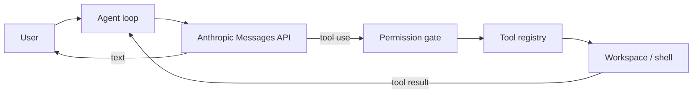

# HelloCode

[](https://github.com/ChanTso/HelloCode/actions/workflows/ci.yml)
[](https://nodejs.org/)
[](LICENSE)

A small, practical coding agent for the terminal, built in TypeScript around one model–tool loop.

HelloCode gives Claude a focused set of workspace tools, streams its work, enforces permission boundaries, and keeps enough session context to handle real repository tasks. It is deliberately a product-sized CLI rather than a teaching framework or a clone of every Claude Code feature.

```text
$ hellocode
HelloCode · claude-sonnet-5 · default
/work/api

› add validation to the user endpoint and run its tests
→ search_text router.post in src
✓ search_text
→ read_file src/routes/users.ts
✓ read_file
→ edit_file src/routes/users.ts
✓ edit_file
→ run_command npm test -- users
? Allow shell: npm test -- users? [y/N] y
✓ run_command

Added request validation and covered the invalid-input path. The focused test suite passes.
```

## Quick start

Requires Node.js 20.19 or newer and an [Anthropic API key](https://console.anthropic.com/settings/keys).

```sh
npm install --global github:ChanTso/HelloCode
export ANTHROPIC_API_KEY="your-api-key"
hellocode
```

To install from a local checkout instead:

```sh
git clone https://github.com/ChanTso/HelloCode.git
cd HelloCode
npm ci
npm link
```

## What it does

- Runs a direct `model → tool → model` loop with streamed text and complete tool-call history.
- Reads, lists, searches, creates, and edits files inside one canonical workspace.
- Runs project commands with approval, timeouts, bounded output, and cancellation.
- Protects sensitive file access and rejects file-tool paths that escape through traversal or symlinks.
- Supports interactive work, one-shot output, read-only planning, and an explicit permission bypass.
- Saves workspace-scoped sessions with private file permissions and resumes them with `--continue`.
- Compacts older turns and oversized tool results without breaking tool-use/result pairs.
- Loads a bounded root-level `AGENTS.md` as project guidance.

### Tools

| Tool          | Purpose                                                                       |
| ------------- | ----------------------------------------------------------------------------- |
| `read_file`   | Read UTF-8 files with line numbers and pagination                             |
| `list_files`  | List files with lightweight glob matching                                     |
| `search_text` | Literal or regex search; uses `rg` when available and has a built-in fallback |
| `edit_file`   | Make an exact, uniqueness-checked replacement                                 |
| `write_file`  | Create a file or explicitly replace one, using an atomic write                |
| `run_command` | Run a shell command in the workspace with a timeout and bounded output        |

## Usage

Start an interactive session:

```sh
hellocode
```

Run once. Assistant text goes to stdout; progress and errors go to stderr:

```sh
hellocode --print "explain why the tests fail"
echo "summarize the current diff" | hellocode --print
```

Resume the latest session for the current workspace:

```sh
hellocode --continue
```

Useful options:

```text
-p, --print                          Run once and exit
-c, --continue                       Resume the latest workspace session
-m, --model <id>                     Select an Anthropic model
-C, --cwd <path>                     Use a different workspace
    --plan                           Deny edits and shell commands
    --dangerously-skip-permissions   Skip approval prompts
    --no-save                        Do not write session history
    --max-turns <number>             Bound model turns for one request
```

Inside interactive mode, `/help`, `/clear`, `/compact`, and `/exit` manage the current conversation.

### Permissions

| Action                   | Default | `--plan`                   | `--dangerously-skip-permissions` |
| ------------------------ | ------- | -------------------------- | -------------------------------- |
| Ordinary workspace reads | Allow   | Allow                      | Allow                            |
| Workspace edits          | Allow   | Deny                       | Allow                            |
| Sensitive file access    | Ask     | Ask for reads; deny writes | Allow                            |
| Shell commands           | Ask     | Deny                       | Allow                            |

Approval-required actions are denied in print mode because there is no interactive prompt. The bypass flag skips HelloCode's approval gate; it does not disable the file tools' workspace boundary.

## Architecture

The model decides what to do. The harness supplies a small operational environment and validates every action at its boundary.



The loop has no task router or hard-coded workflow:

```text
append user message
repeat:
  stream one complete model response
  append the full assistant content
  if the response requests tools:
    validate, authorize, and execute each tool in order
    append every matching tool result
  otherwise:
    return
```

The main boundaries are intentionally direct:

```text
CLI / terminal UI
  └── Agent loop
      ├── Anthropic adapter
      ├── Context manager
      └── Tool registry
          ├── Permission gate
          ├── Workspace path boundary
          └── File and shell tools
```

## Design choices

- **One stable loop.** New capability belongs in a tool or at a loop boundary, not in a second orchestration system.
- **Model-led behavior.** The harness validates and executes actions; it does not replace model judgment with a rule tree.
- **Safe defaults with honest limits.** File tools stay in the workspace, sensitive access and shell commands require approval, and the documentation does not call that an OS sandbox.
- **Cheap context controls first.** Tools paginate or cap output, then old results and complete conversation turns are compacted when needed.
- **Small dependency surface.** The Anthropic SDK is the only runtime dependency. Argument parsing, terminal input, process control, and file handling use Node.js.

## Configuration

| Variable                  | Meaning                                      | Default           |
| ------------------------- | -------------------------------------------- | ----------------- |
| `ANTHROPIC_API_KEY`       | Anthropic API credential                     | Required          |
| `HELLOCODE_MODEL`         | Model used when `--model` is absent          | `claude-sonnet-5` |
| `HELLOCODE_HOME`          | Session data directory                       | `~/.hellocode`    |
| `HELLOCODE_CONTEXT_CHARS` | Approximate history budget before compaction | `600000`          |
| `NO_COLOR`                | Disable terminal colors                      | Unset             |

Session documents can contain prompts, source excerpts, command output, and model reasoning blocks. They are stored outside the repository under `~/.hellocode/sessions/` (or `$XDG_STATE_HOME/hellocode/sessions/`) with directory mode `0700` and file mode `0600` on POSIX systems. Use `--no-save` for sensitive work.

## Security

`run_command` executes with your operating-system account. Approval is a trust checkpoint, not process isolation; an approved command can access anything your account can access. HelloCode removes `ANTHROPIC_API_KEY` from child-process environments, but it cannot identify every credential available on a machine.

File tools canonicalize paths, reject traversal and symlink escapes, and refuse writes through a symlink. These controls do not constrain an approved shell command. See [SECURITY.md](SECURITY.md) for the full trust model and reporting instructions.

## Development

```sh
npm ci
npm run check
npm run build
npm pack --dry-run
```

`npm run check` runs formatting, ESLint, strict TypeScript checking, and the offline Vitest suite. Tests use a fake model; no API key or network access is required.

## Roadmap

- Optional OS-level sandbox adapters for commands.
- Named session listing and explicit session selection.
- Model-assisted summaries for very long-running conversations.
- Richer patch previews and per-action approval policies.

Provider proliferation, task graphs, agent teams, background schedulers, and a general plugin framework are intentionally outside the first release.

## Inspiration

HelloCode was inspired by the public harness-engineering ideas in [shareAI-lab/learn-claude-code](https://github.com/shareAI-lab/learn-claude-code): keep the model in charge and make tools, context, and permissions explicit. The implementation, product scope, code, naming, and documentation here were designed independently. HelloCode is not affiliated with Anthropic or the reference project.

## License

[MIT](LICENSE) © 2026 ChanTso
